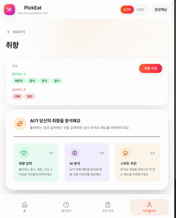
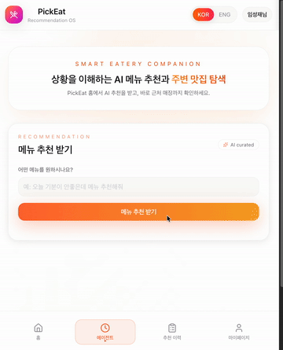

<div align="center">

# PickEat Frontend

**AI 기반 맞춤형 메뉴 추천 서비스의 프론트엔드 웹 애플리케이션**

[www.pick-eat-fe-web.vercel.app](https://www.pick-eat-fe-web.vercel.app)


[프로젝트 개요](#프로젝트-개요) · [주요 기능](#주요-기능) · [기술 스택](#기술-스택) · [아키텍처](#아키텍처) · [시작하기](#시작하기)

</div>

---

## 프로젝트 개요

<div align="center">
  
</div>

<br>

매일 반복되는 "오늘 뭐 먹지?"라는 고민,
기존 서비스에서는 사용자 취향을 반영한 메뉴 추천을 제공하지 못하는 문제가 있습니다.

**PickEat**은 이 문제를 해결하기 위한 프로젝트로,
OpenAI GPT와 Google Gemini를 결합하여
**"취향 분석 → 메뉴 추천 → 맛집 탐색"** 까지의 흐름을 하나의 서비스로 제공합니다.

- 사용자의 식사 패턴을 AI가 자동으로 분석하여 선호도를 학습하고
- 학습된 취향과 유저의 요청사항을 분석하여 맞춤 메뉴를 실시간 스트리밍으로 추천하며
- 추천된 메뉴를 먹을 수 있는 등록된 주소 근처의 맛집까지 검색해줍니다

---

## 주요 기능

<table>
<tr>
<td align="center" width="50%">

<br/>
<b>취향 설정</b>
<br/>
<sub>음식 취향, 알레르기, 식사 스타일 등을 설정하여 AI 메뉴 추천의 기반 데이터를 구성합니다.</sub>
</td>
<td align="center" width="50%">

<br/>
<b>AI 메뉴 추천</b>
<br/>
<sub><code>GPT-4o</code> 검증 → <code>GPT-5-mini</code> 트렌드 분석 → <code>GPT-5.1</code> 메뉴 추천 3단계 파이프라인으로 맞춤 메뉴를 추천하고, <code>SSE</code> 스트리밍으로 실시간 응답합니다.</sub>
</td>
</tr>
<tr>
<td align="center" width="50%">

<br/>
<b>맛집 추천</b>
<br/>
<sub><code>Gemini Maps Grounding</code>과 <code>Google Places API</code>를 연동하여 주변 맛집을 검색하고 추천합니다.</sub>
</td>
<td align="center" width="50%">

<br/>
<b>가게 상세</b>
<br/>
<sub>AI가 작성한 가게 설명, 평점, 리뷰 요약을 제공합니다.</sub>
</td>
</tr>
</table>

---

## 기술 스택

### Frontend


### Styling / UI


### External API


### i18n


### Infra / Test


---

## 아키텍처


---

## 시작하기

### 사전 요구사항

- **Node.js** >= 20
- **npm**

### 설치

```bash
# 저장소 클론
git clone https://github.com/LSJ0621/PickEat_FE_Web.git
cd PickEat_FE_Web

# 환경 변수 설정
cp .env.example .env.local
# .env.local 파일에 API 키(Google Maps, Kakao, Google OAuth 등)를 입력하세요

# 의존성 설치
npm install

# 개발 서버 실행
npm run dev    # → http://localhost:8080
```

### 환경변수

| 변수 | 설명 |
|------|------|
| `VITE_API_BASE_URL` | 백엔드 API URL |
| `VITE_KAKAO_CLIENT_ID` | 카카오 OAuth 클라이언트 ID |
| `VITE_KAKAO_REDIRECT_URI` | 카카오 OAuth 리다이렉트 URI |
| `VITE_GOOGLE_CLIENT_ID` | 구글 OAuth 클라이언트 ID |
| `VITE_GOOGLE_REDIRECT_URI` | 구글 OAuth 리다이렉트 URI |
| `VITE_GOOGLE_MAPS_API_KEY` | 구글 맵 API 키 |
| `VITE_GOOGLE_MAP_ID` | 구글 맵 ID |

---

## Scripts

| 명령어 | 설명 |
|--------|------|
| `npm run dev` | 개발 서버 실행 (port 8080) |
| `npm run build` | TypeScript + Vite 프로덕션 빌드 |
| `npm run lint` | ESLint 검사 |
| `npm run preview` | 빌드 결과 미리보기 |
| `npm run test` | 단위 테스트 (watch 모드) |
| `npm run test:run` | 단위 테스트 (1회 실행) |
| `npm run test:coverage` | 커버리지 리포트 생성 |
| `npm run test:e2e` | E2E 테스트 실행 |
| `npm run test:e2e:ui` | E2E 테스트 UI 모드 |

---

## 문서

| 문서 | 설명 |
|------|------|
| [Architecture](docs/architecture.md) | 시스템 아키텍처 및 데이터 흐름 |
| [Frontend Structure](docs/frontend-structure.md) | 디렉토리 구조 및 레이어 설명 |
| [Testing](docs/testing/README.md) | 406건 테스트 (Vitest 384 + Playwright 22) / Lines 커버리지 83.31% (Hooks+Utils scope) / Playwright 병렬 경합 회고 |

